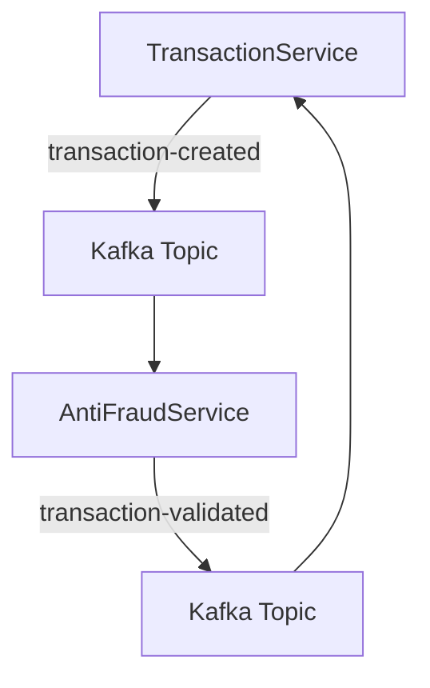

# Technical Challenge - Transaction Validation System

This project implements a complete microservice-based transaction validation system with anti-fraud logic, developed as part of the LT Yape Bolivia technical challenge.

---

## ✨ Technologies Used

* **.NET 8** with ASP.NET Core
* **Entity Framework Core** with **PostgreSQL**
* **Apache Kafka** for event-driven communication
* **Docker & Docker Compose** for containerization
* **Clean/Onion Architecture**

---

## 📊 Architecture Overview

The system consists of two microservices:

* `TransactionService`: handles transaction creation and status updates
* `AntiFraudService`: processes business rules and validates transactions

### 📘 Communication Flow



Each service maintains its own PostgreSQL database. The business logic is structured using Clean Architecture principles with separate `Domain`, `Application`, `Infrastructure`, and `API` layers.

---

## 🚀 Running the System

### Prerequisites

* Docker and Docker Compose installed
* .NET SDK 8.0 (optional, for local builds or development)

### Start the System

```bash
docker compose up -d --build
```

This starts:

* PostgreSQL
* Kafka + Zookeeper
* TransactionService
* AntiFraudService

### Apply Migrations (first time only)

```bash
docker run --rm \
  --network=antifraudsolution_default \
  -v ${PWD}:/app \
  -w /app \
  mcr.microsoft.com/dotnet/sdk:8.0 \
  sh -c 'dotnet tool install -g dotnet-ef && export PATH=$PATH:/root/.dotnet/tools && dotnet ef database update --project src/TransactionService/TransactionService.csproj'
```

Repeat for `AntiFraudService` if needed.

---

## 🌐 Available Endpoints

### `TransactionService`

* `POST /api/transactions`
  Creates a new transaction with initial status `pending`

```json
{
  "sourceAccountId": "Guid",
  "targetAccountId": "Guid",
  "transferTypeId": 1,
  "value": 2500
}
```

* `GET /api/transactions/{id}`
  Returns transaction status, creation date, and other details

### `AntiFraudService`

* Listens to `transaction-created` events
* Applies validation rules:

  * Reject if value > 2000
  * Reject if total daily sum > 20000
  * Approve otherwise
* Emits `transaction-validated` events back to Kafka

---

## ✅ Requirements Coverage

| Requirement                                     | Status |
| ----------------------------------------------- | ------ |
| Transaction states: pending, approved, rejected | ✅      |
| Anti-fraud validation in microservice           | ✅      |
| Kafka event-based communication                 | ✅      |
| Independent persistence per service             | ✅      |
| Architecture diagram                            | ✅      |
| PostgreSQL and Kafka via Docker                 | ✅      |
| Clean architecture structure                    | ✅      |

---

## 👨‍💻 Author

**Andrés Monroy** — Fullstack Developer (.NET / Angular / Kafka)

This project demonstrates the implementation of microservices, event-based architecture, and clean separation of concerns using modern .NET technologies.

---

# Reto Técnico - Sistema de Validación de Transacciones

Este proyecto implementa un sistema completo de validación de transacciones con lógica antifraude, desarrollado como parte del reto técnico de LT Yape Bolivia.

---

## ✨ Tecnologías utilizadas

* **.NET 8** con ASP.NET Core
* **Entity Framework Core** con **PostgreSQL**
* **Apache Kafka** para eventos distribuidos
* **Docker & Docker Compose** para contenerización
* **Arquitectura Clean/Onion**

---

## 📊 Arquitectura general

El sistema está compuesto por dos microservicios:

* `TransactionService`: maneja creación y actualización de transacciones
* `AntiFraudService`: valida transacciones mediante reglas de negocio

### 📘 Flujo de comunicación


Cada servicio mantiene su propia base PostgreSQL. La lógica está estructurada en capas siguiendo el patrón Clean Architecture (`Domain`, `Application`, `Infrastructure`, `API`).

---

## 🚀 Ejecución del sistema

### Requisitos

* Docker y Docker Compose instalados
* .NET SDK 8.0 (opcional, para desarrollo local)

### Iniciar el sistema

```bash
docker compose up -d --build
```

Esto levanta:

* PostgreSQL
* Kafka + Zookeeper
* TransactionService
* AntiFraudService

### Aplicar migraciones (solo la primera vez)

```bash
docker run --rm \
  --network=antifraudsolution_default \
  -v ${PWD}:/app \
  -w /app \
  mcr.microsoft.com/dotnet/sdk:8.0 \
  sh -c 'dotnet tool install -g dotnet-ef && export PATH=$PATH:/root/.dotnet/tools && dotnet ef database update --project src/TransactionService/TransactionService.csproj'
```

Repetir para `AntiFraudService` si aplica.

---

## 🌐 Endpoints disponibles

### `TransactionService`

* `POST /api/transactions`
  Crea una transacción con estado inicial `pending`

```json
{
  "sourceAccountId": "Guid",
  "targetAccountId": "Guid",
  "transferTypeId": 1,
  "value": 2500
}
```

* `GET /api/transactions/{id}`
  Retorna estado, fecha de creación y otros detalles

### `AntiFraudService`

* Escucha eventos `transaction-created`
* Aplica validación:

  * Rechaza si `value > 2000`
  * Rechaza si total diario > 20000
  * Aprueba en cualquier otro caso
* Publica evento `transaction-validated` en Kafka

---

## ✅ Requisitos cumplidos

| Requisito                                 | Estado |
| ----------------------------------------- | ------ |
| Estados `pending`, `approved`, `rejected` | ✅      |
| Validación antifraude como microservicio  | ✅      |
| Comunicación por eventos Kafka            | ✅      |
| Persistencia por microservicio            | ✅      |
| Diagrama de arquitectura                  | ✅      |
| PostgreSQL y Kafka con Docker             | ✅      |
| Estructura tipo Clean Architecture        | ✅      |

---

## 👨‍💻 Autor

**Andrés Monroy** — Desarrollador Fullstack (.NET / Angular / Kafka)

Este proyecto demuestra dominio de microservicios, mensajería distribuida y separación de capas aplicando principios de arquitectura moderna.
